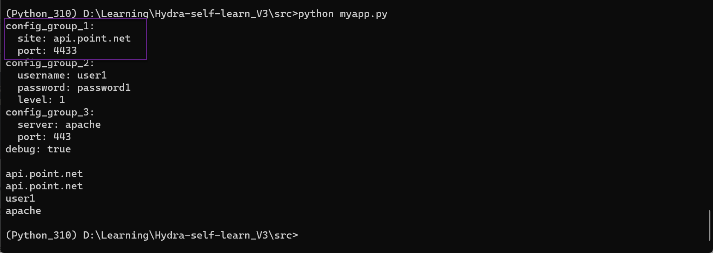
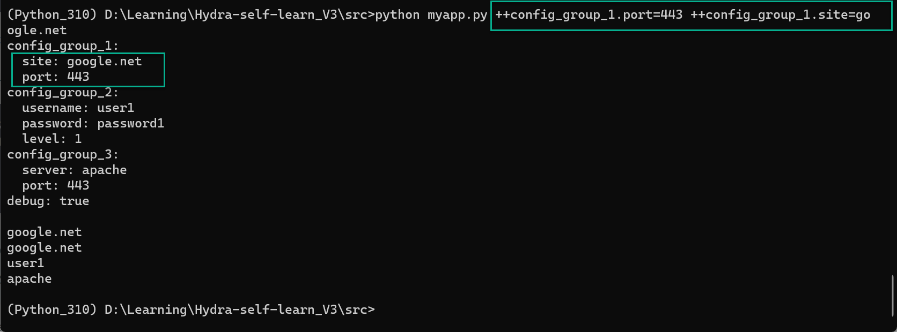

# Application Documentation for users

## How to pass arguments to the application

The Hydra application can be configured using command line arguments. The following is a list of the arguments that can be passed to the application base on the current application layout

## Example of the base application launch

## Example of the application launch with arguments

